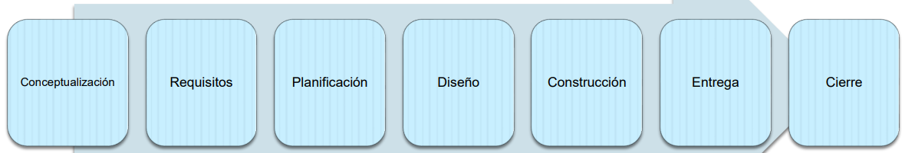
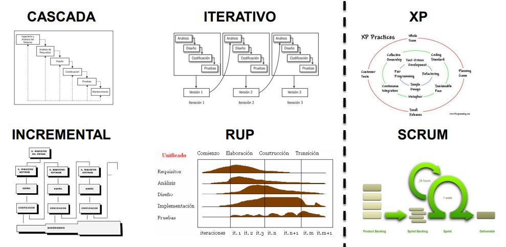
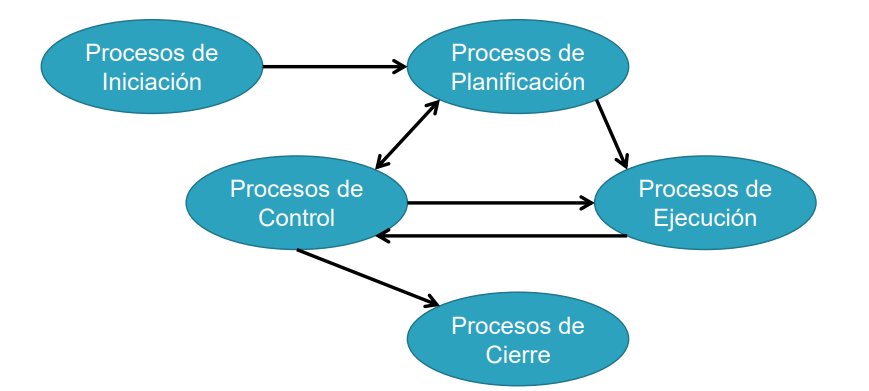
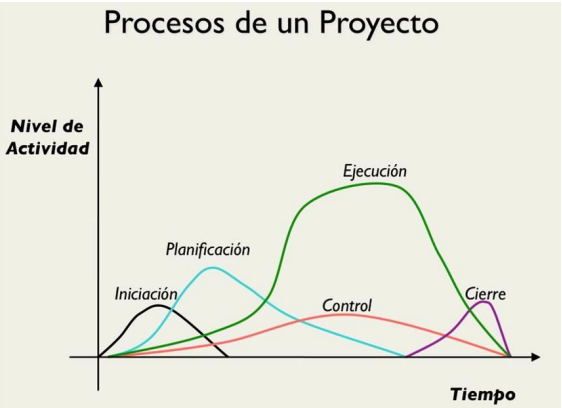
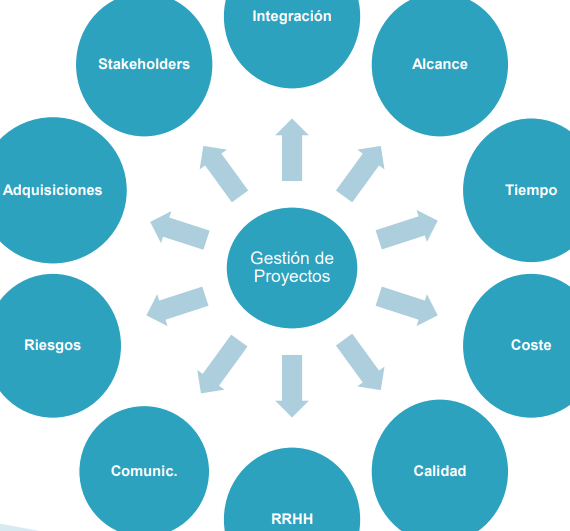
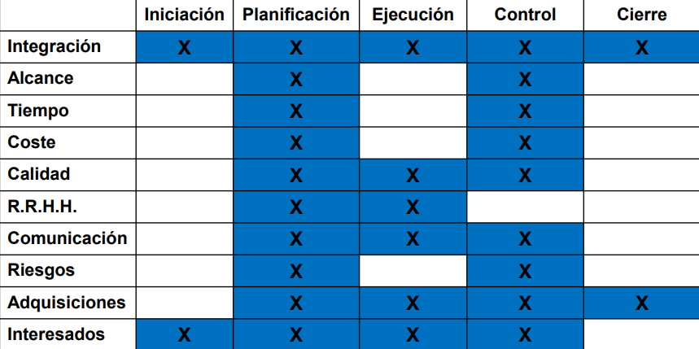

# Introdución a la Dirección y la Gestión de Proyectos Software
## Índice
1. Concepto de proyecto
2. Desarrollo de un proyecto
3. La gestión de los proyectos
4. Éxito y fracaso en proyectos
5. Habilidades, Roles y Responsabilidades del Director de proyecto
6. ¿Cómo surgen los proyectos?
7. Contratación del Sector Público

## Concepto de proyecto

En la sociedad exsiten diferentes formas de organizar el trabajo:
* **En masa**:
  * Esamblaje de un producto u oferta de un servicio
  * Economía de Escala
  * Productos o Servicios con características muy especializadas
* **Por lotes**: 
  * Sistemas flexibles que sirven para la producción de productos similares
  * Cambiar y recomponer la planta de producción para las diferentes series
* **Producir o alcanzar objetivos no repetitivos**:
  * Producto que se realizará una vez
  * Se realizará una serie de tareas específicas, que no se han realizado y que posiblemente no se vuelvan a realizar

### ¿Qué es un Proyecto?
* "Un proyecto es un esfuerzo **temporal** emprendido para crear un **único** producto o servicio" **(PMI)**
* **Temporal:** Con un principio y un final bien definidos
* **Único:** Que genera un producto o servicio con unas características únicas
* **Objetivos específicos:** Debe de complirlos

**Un proyecto es un esfuerzo temporal emprendido para crear un único producto o servicio, con un punto de inicio y de fin definidos, y unos objetivos que, una vez cumplidos, significan su finalización**

### Características de un proyecto:
* Existen objetivos claros
* Se pueden indentificar un conjunto de tareas
* Es necesatia la intervención de especialistas
* Existen limitaciones en los recursos
* Tienen un principio y fin en el tiempo
* Se requiere un nivel de calidad
* Se requiere una planificación

### Ciclo de Vida - Procesos Productivos

### Gestión de Proyectos - Procesos de Gestión

### Ciclo de Vida - Metodologías de Desarrollo

## La gestión de los proyectos
### ¿Qué es la gestión?
Articular el método para alcanzar un objetivo único y no repetitivo en un plazo con principio y fin claros utilizando las técnicas que nos proporciona la gestión

### Funciones de la Gestión
* **Planificar**: Determina qué resultados ha de obtener la
organización y establece estrategias adecuadas para su
realización.
* **Organizar**: Especifica cómo lograr los resultados
planificados, asignando las tareas identificadas en la
planificación a los miembros y equipos de la organización
para que se alcancen dichos objetivos.
* **Controlar**: Comprobar si se están alcanzando los
resultados previstos, corrigiendo las desviaciones que se
detecten.
* **Dirigir**: Liderar y motivar a los miembros de la
organización, de modo que se alcancen los objetivos
marcados.

### Triple-Cuadruple Restricción
* Tiempo
* Costo
* Alcance
* Calidad

### Procesos de Gestión de Proyectos

### Áreas de Conocimiento

### Objetivos de las áreas de conocimiento
**Integración:** Asegurar que los distintos elementos del proyecto son coodinados apropiadamente
**Alcance:** Cumplir el alcance del producto, medido contra los requerimientos, y el alcance del proyecto, medido contra el plan
**Tiempo:** Asegurar que el proyecto termine a tiempo
**Coste:** Asegurar que el proyecto termina dentro del presupuesto aprobado
**RR.HH:** Hacer la gestión más eficaz de las personas involucradas en el proyecto
**Comunicación:** Asegurar la oportuna y apropiada generación, recolección, distribución, almacenamiento y disposición final de la información del proyecto
**Riesgos:** Identificar, analizar y responder a los riesgos del proyecto
**Adquisiciones:** Adquirir los bienes y servicios necesarios, provistos por terceros, ajenos a la organización
**Interesados/Stakeholder** Gestionar la participación de los interesados, y controlar sus niveles de influencia en el mismo

### Relación entre Procesos de Gestión y Áreas de Conocimiento de la Gestión de Proyectos

## Éxito y Fracaso en proyectos
### ¿Por qué Fracasan los Proyectos?
* Un estudio frágil
* Falta de apoyo y compromiso por parte de la alta direccion
* Planificación de proyecto inadecuada
* Ausencia de implicación de los usuarios durante el proyecto
* Tecnología nueva o no familiar a la organización
* Dalta de implicación del negocio

### ¿Por qué tienen éxito los Proyectos?
* Procesos de gestión de proyectos sólidos
* Proyectos ligados a los objetivos estratégicos y de negocio de la organización
* Soporte y compromiso de parte de la alta dirección
* Buena gestión de cambios
* Requerimientos detallados
* Buenas relaciones entre los interesados
* Miembros del equipo capaces y bien alineados con el proyecto
* Roles y responsabilidades claramente definidas
* Existencia de fondos económicos realistas y disponibles
* Planificación de tiempo realista

## Habilidades, Roles y Responsabilidades del Director de proyecto

### Habilidades necesarias en los Gestores de Proyectos:
* **Capacidades Duras(Hard Skills)**:
  * Técnicas
  * Planificación
  * Contratación
  * Realización de presupuestos
  * Medición de rendimiento
  * Monitorización de calidad
  * Análisis de riesgos
* **Capacidades Blandas(Soft Skills)**:
  * Comunicación
  * Negociación
  * Liderazgo
  * Resolución de problemas
  * Gestión de cambios
  * Políticamente astuto
  * Pensamiento global

### Roles y Responsabilidades del Gestor del proyecto:
* Definición del alcance del proyecto
* Selección, contrucción y liderazgo del equipo del proyecto
* Identificación y asesoría de los interesados
* Desarrollo del plan del proyecto, incluyendo EDT, presupuesto y planificación de tiempo
* Gestión y control de riesgos del proyecto
* Gestión de todos los cambios del proyecto
* Gestión de la triple restricción
* Monitorización y comunicación del avance y estado del proyecto

## ¿Comó surgen los proyectos?
**Los proyectos deben surgir como respuesta a necesidades u objetivos estratégicos de la organización**
### Normalmente como respuesta a:
* Productos o sistemas que quedan obsoletos
* Necesidades de más competitividad tecnológica
* Necesidades propuestas por empleados
* Oportunidades para incrementar los beneficios, reducir costes y/o mejorar la productividad
* Visión estratégica de la organización
* Intereses públicos y privados, dependiendo del carácter de la organización

**Valorar la viabilidad del proyecto en función de los beneficios y los costes**

**Formular datos cuantitativos para revisión analítica, en base a datos históricos de experiencias anteriores**
* Las opiniones, deseos o expectativas de clientes,
accionistas, empleados y/o directivos
* La alineación del proyecto con la estrategia de la
organización
* Un análisis de riesgos preliminar

### Analizar los datos utilizando herramientas financieras
* Ratio beneficio/costes
* Valor actual neto
* Retorno de la Inversión(ROI)
* Periodo de restitución de la Inversión

### Buscar la solución técnica más adecuada para cada proyecto:
* Económicamente
* Temporalmente
* Conocida
* Mantenimiento y ampliación