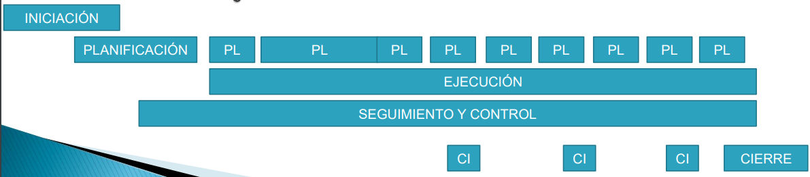

# Introdución a la Dirección y la Gestión de Proyectos Software
## Índice
1. Concepto de proyecto
2. Desarrollo de un proyecto
3. La gestión de los proyectos
4. Éxito y fracaso en proyectos
5. Habilidades, Roles y Responsabilidades del Director de proyecto
6. ¿Cómo surgen los proyectos?
7. Contratación del Sector Público

## Concepto de proyecto

En la sociedad exsiten diferentes formas de organizar el trabajo:
* **En masa**:
  * Esamblaje de un producto u oferta de un servicio
  * Economía de Escala
  * Productos o Servicios con características muy especializadas
* **Por lotes**: 
  * Sistemas flexibles que sirven para la producción de productos similares
  * Cambiar y recomponer la planta de producción para las diferentes series
* **Producir o alcanzar objetivos no repetitivos**:
  * Producto que se realizará una vez
  * Se realizará una serie de tareas específicas, que no se han realizado y que posiblemente no se vuelvan a realizar

### ¿Qué es un Proyecto?
* "Un proyecto es un esfuerzo **temporal** emprendido para crear un **único** producto o servicio" **(PMI)**
* **Temporal:** Con un principio y un final bien definidos
* **Único:** Que genera un producto o servicio con unas características únicas
* **Objetivos específicos:** Debe de complirlos

**Un proyecto es un esfuerzo temporal emprendido para crear un único producto o servicio, con un punto de inicio y de fin definidos, y unos objetivos que, una vez cumplidos, significan su finalización**

### Características de un proyecto:
* Existen objetivos claros
* Se pueden indentificar un conjunto de tareas
* Es necesatia la intervención de especialistas
* Existen limitaciones en los recursos
* Tienen un principio y fin en el tiempo
* Se requiere un nivel de calidad
* Se requiere una planificación

### Ciclo de Vida - Procesos Productivos

### Gestión de Proyectos - Procesos de Gestión

### Ciclo de Vida - Metodologías de Desarrollo

## La gestión de los proyectos
### ¿Qué es la gestión?
Articular el método para alcanzar un objetivo único y no repetitivo en un plazo con principio y fin claros utilizando las técnicas que nos proporciona la gestión

### Funciones de la Gestión
* **Planificar**: Determina qué resultados ha de obtener la
organización y establece estrategias adecuadas para su
realización.
* **Organizar**: Especifica cómo lograr los resultados
planificados, asignando las tareas identificadas en la
planificación a los miembros y equipos de la organización
para que se alcancen dichos objetivos.
* **Controlar**: Comprobar si se están alcanzando los
resultados previstos, corrigiendo las desviaciones que se
detecten.
* **Dirigir**: Liderar y motivar a los miembros de la
organización, de modo que se alcancen los objetivos
marcados.

### Triple-Cuadruple Restricción
* Tiempo
* Costo
* Alcance
* Calidad

### Procesos de Gestión de Proyectos

### Áreas de Conocimiento
